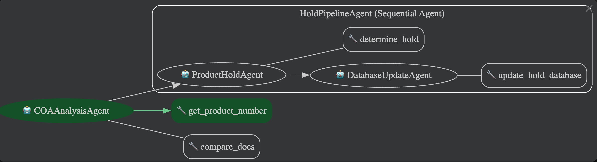

# COA-ADK-Agent

An AI Agent built with the ADK Framework that analyzes a certificate of analysis against it's spec sheet. 

## Getting Started

To get a local copy up and running, follow these steps.

### Installation

1.  **Clone the repository**

2.  **Create and activate a virtual environment**\
    * `python3 -m venv env`
    * `source env/bin/activate`

3.  **Install dependencies**

     * `pip install -r requirements.txt`

4.  **Configure environment variables**

    * Create a `.env` file in the root directory and add the necessary configuration using the `.envexample` file as a template.

## Usage
To test the agent locally, cd to the `agents` director and run `adk web` in the terminal.

Ensure all files in the `sample_docs` folder are loaded into your GCS bucket before trying to use the agent. The bucket name should be set in the BUCKET environment variable. 

The agent can then be prompted by providing the GCS URI to either of the sample COAs provided. 

## Agent Design

The agent takes in a Google Cloud Storage URI as an input to point to a COA document.

After recieving the COA document, the agent will extract the product number using the `get_product_number` tool,\
and use this to find the relevant spec sheet. The Agent will then pass the spec sheet and COA to the `compare_docs` \
tool to analyze the COA against the Spec Sheet. The analysis and product number are both stored as State variables.

After the analysis, the root agent will hand the interation to the `ProductHoldAgent`, which is responsible for reviewing\
the analysis and determining if a product should be put on hold using the `determine_hold` tool. Lastly, if the product should\
be put on hold, the agent will update the hold database with the product number using the `update_hold_database` tool.

